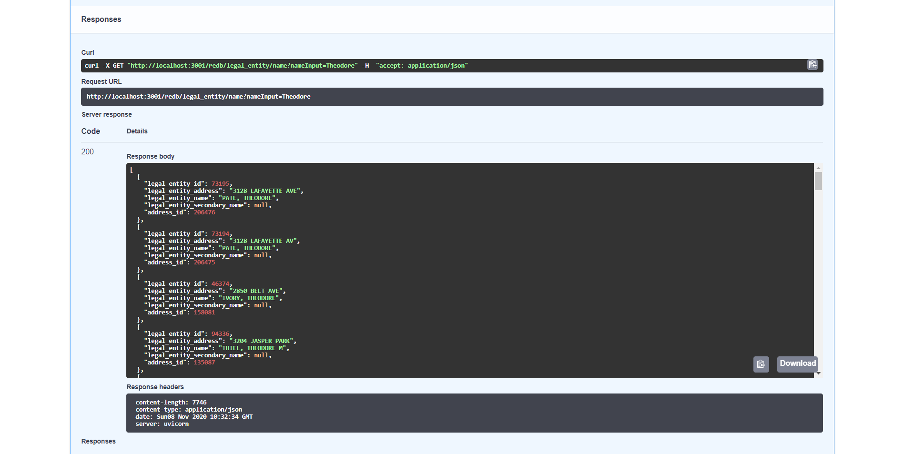

# REDB API (Abridged)
An asynchronous REST API for accessing St. Louis Parcel Data stored in the Regional Entity Database (REDB). 

This repository features an abridged version of the actual REDB-API, the actual repository can be found here: https://github.com/stlrda/redb-api  

More information on the Regional Entity Database can be found here: https://github.com/stlrda/REDB-Workflows  

REDB-API is a public facing API that comes equipped with interactive documentation thanks to the Fast-API library. Said documentation can be utilized by anyone over the internet either programatically or through a web browser. Below is a demonstration of using the point-and-click web interface to preview and retrieve data from the Regional Entity Database.

## Home Screen Preview #1

## Home Screen Preview #2

## Queries Screen Preview #1

## Inputting the name "Theodore" for Legal Entity data

## Legal Entity data returned from input "Theodore"

## You can download the JSON returned from queries

## Grabbing the same Legal Entity data by id

## Getting Parcel data for given Legal Entity ID

## Getting Parcel data from a REDB parcel_id

## Parcel data returned after submitting address: 4921 THEKLA AV

## Building counts for Parcels of a certain kind (in this case, those in Ward 9)

## Parcel IDs for all Parcels of a certain kind (in this case, those in Ward 9)

## Retrieving an excessive amount of data for a Parcel by the handle 10097000030

## See the last time REDB was updated

## Routes and Query Parameters
* /redb/parcel/redb_id
  This endpoint returns json which contain information about the parcel(s), building(s), and unit(s) related to a parcel id.  
  The redb_id endpoint requires two inputs for a get request. 
  - {ParcelInput: str} - Input the full redb parcel id that you want to search the database for 
  - {Current: bool} - True returns only current data, False returns all data and includes the current_flag field in the output 

* /redb/parcel/legal_entity_id
  This endpoint returns json which contain information about the parcel(s), building(s), and unit(s) related to a legal_entity_id.  
  The legal_entity_id endpoint requires two inputs for a get request. 
  - {IdInput: str} - Input the legal_entity_id that you want to search the database for 
  - {Current: bool} - True returns only current data, False returns all data and includes the current_flag field in the output 

* /redb/parcel/adddress
  This endpoint returns json which contain information about the parcel(s), building(s), and unit(s) related to a street address.  
  The address endpoint requires two inputs for a get request. 
  - {AddressInput: str} - Input the address that you want to search the database for 
  - {Current: bool} - True returns only current data, False returns all data and includes the current_flag field in the output 

  The address end point uses trigrams and fuzzy matching in order to return all the information related to an address in the database that most closely matches the AddressInput. 

* /redb/legal_entity/name
  This endpoint returns json which contain information about legal entities within the database based on a name.  
  The name endpoint requires a single input for a get request. 
  - {NameInput: str} - Input the legal_entity_name that you want to search the database for 

  The name endpoint uses trigrams and fuzzy matching in order to return all of the legal entity records whose legal_entity_name field is similar to the NameInput.  The output returned by the end point is ordered such that the closest matches are listed first so being more specific should help you find the desired legal_entity faster.  Legal Names are entered in Lastname, Firstname format.

* /readb/filter/counts
  This endpoint returns json which contain counts of the commercial use and residential use buildings located on parcels that match the selected criteria.  
  The counts endpoint requires two inputs for a get request. 
  - {FilterTypeInput: str} - The field you would like to filter on 
  - {FilterValueInput: str} - The value of the filter field you want to filter on 

  The acceptable criteria for the FileTypeInput field are as follows: 
  [zoning_class, ward, voting_precinct, inspection_area, neighborhood_id, police_district, census_tract] 

* /readb/filter/ids
  This endpoint returns json which contain the parcel_ids of all the parcels that match the selected criteria.  
  The ids endpoint requires two inputs for a get request. 
  - {FilterTypeInput: str} - The field you would like to filter on 
  - {FilterValueInput: str} - The value of the filter field you want to filter on 

  The acceptable criteria for the FileTypeInput field are as follows: 
  [zoning_class, ward, voting_precinct, inspection_area, neighborhood_id, police_district, census_tract] 

* /redb/parcel_detail
  This endpoint returns an excess of information concerning a particular parcel identified by government "handle"
  - {handle: int}

* /redb/latest
  This endpoint returns json containing the date of the most recent update in redb. 